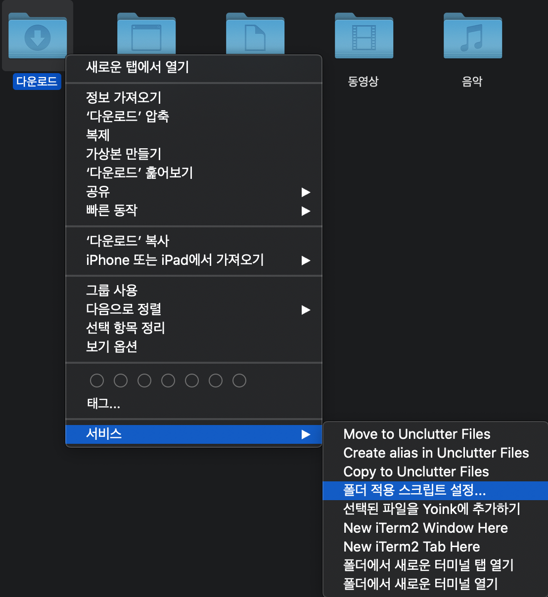
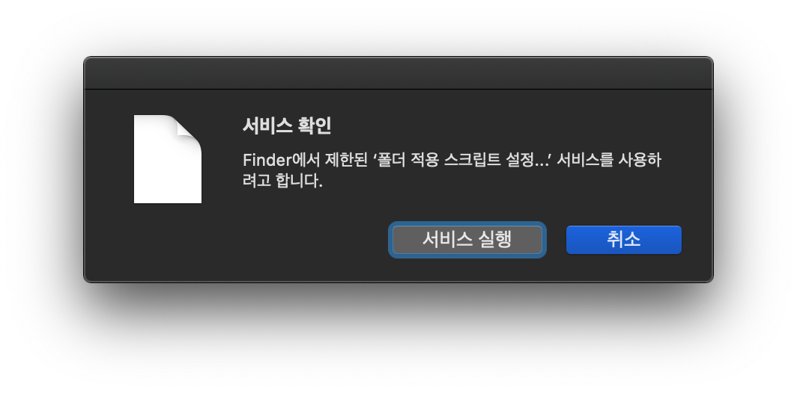
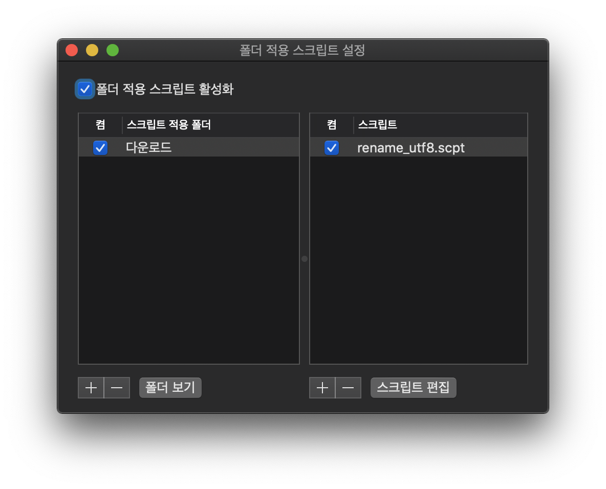

# mac-renaming-file
macOS automatically file renaming from download directory

## 목적

맥에서 파일을 인터넷을 통해 받을 때 파일명이 깨진 경우 utf-8로 인코딩 되어 있다면 디코딩하여 파일이름을 자동으로 변경해 주는 apple script 및 shell script 입니다.

## 사용방법

* rename_utf8.sh 파일을 적당한 폴더에 저장합니다.
* 아래 설명하는 경로에 폴더가 없다면 직접 만듭니다.

``` sh
cd ~/Library/Scripts
ls -al Folder\ Action\ Scripts
# 폴더가 없다면 생성!
mkdir Folder\ Action\ Scripts
```

* 해당 폴더에 rename_utf8.scpt을 저장합니다.
* 이상으로 필요한 파일은 준비가 완료되었습니다. 다음부터는 Finder 앱에서 진행합니다.
* 파일이름을 자동으로 변경할 디렉토리의 설정을 변경합니다.



* 서비스 실행을 클릭합니다.



* 스크립트 편집 왼쪽에 있는 '+' 버튼을 클릭하여 'rename_utf8.scpt' 를 선택합니다.

